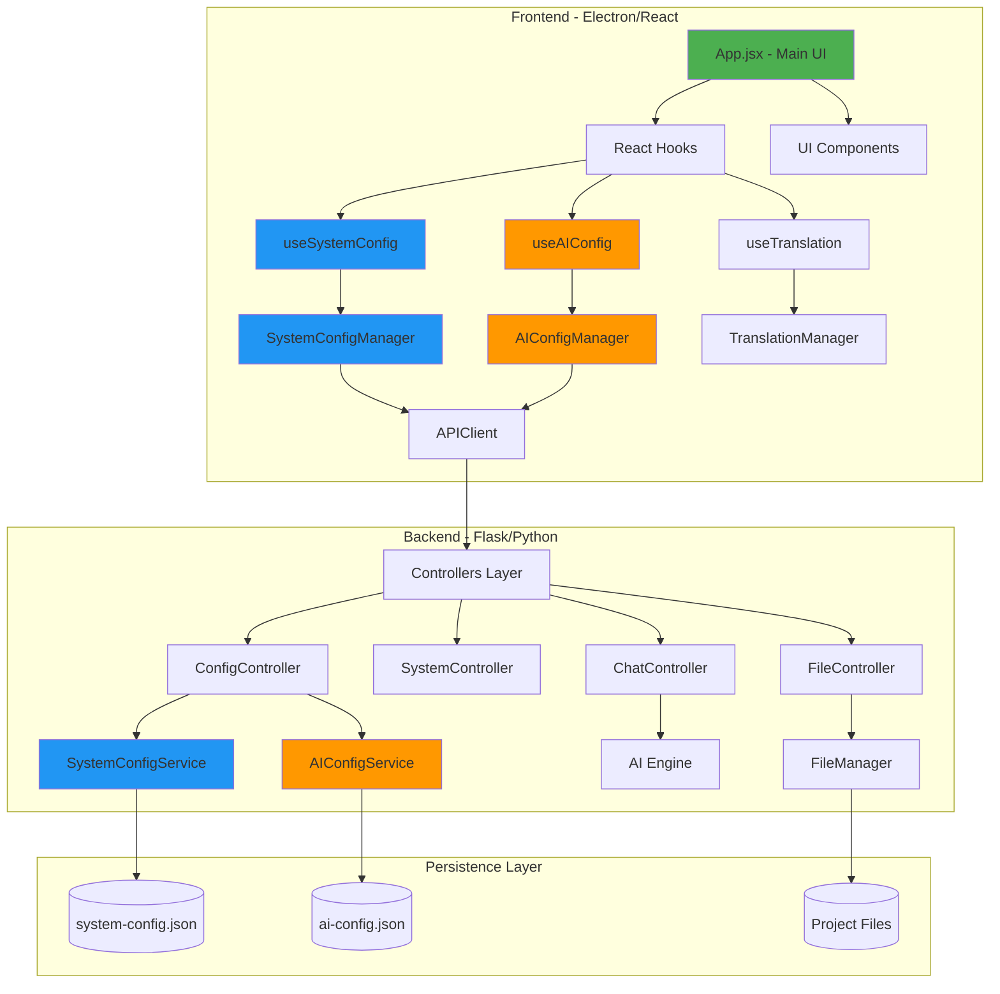
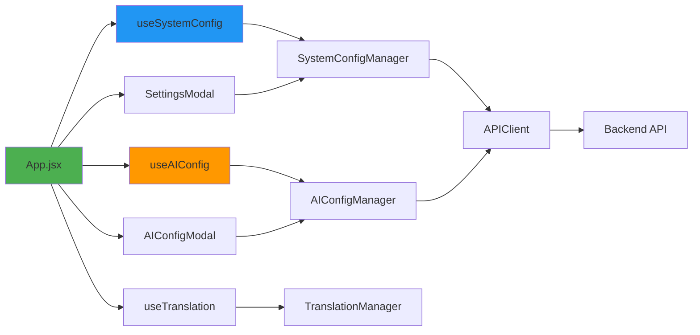
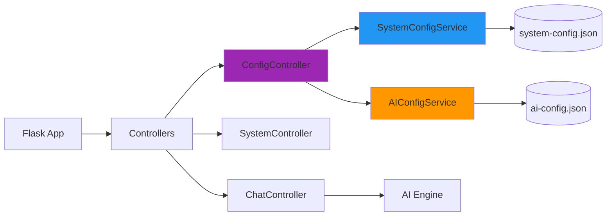
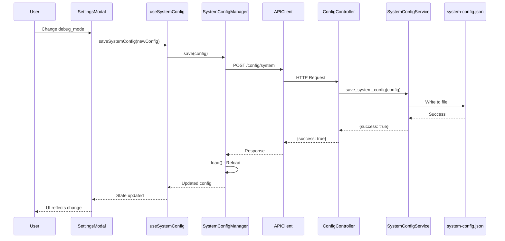
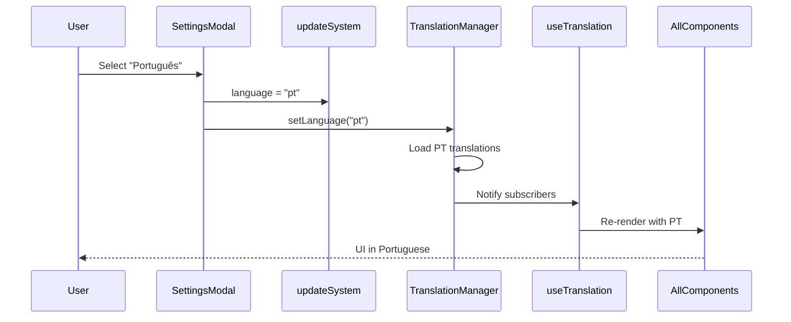

# HexAgentGUI Architecture Documentation
# Documentação de Arquitetura do HexAgentGUI

**Date | Data:** 2026-01-10  
**Version |Versão:** 2.0.0  
**Status:** 🟢 ACTIVE - Post Config Separation Refactoring

---

## Table of Contents | Índice

1. [Project Overview](#project-overview)
2. [Technology Stack](#technology-stack)
3. [Architecture Diagram](#architecture-diagram)
4. [OOP Implementation Status](#oop-implementation-status)
5. [File Structure](#file-structure)
6. [Component Dependencies](#component-dependencies)
7. [Data Flow](#data-flow)

---

## Project Overview

**HexAgentGUI** is an autonomous AI-powered cybersecurity agent with a modern Electron-based GUI.

**Key Features | Principais Recursos:**
- 🤖 AI-powered autonomous agent
- 💬 Interactive chat interface
- 🔒 Cybersecurity tooling integration
- 🌐 Multi-language support (EN/PT-BR)
- 🎨 Dark mode UI with animations
- 📁 File editor and project management

---

## Technology Stack

### Frontend
```yaml
Framework: React 18.3.1
Build Tool: Vite 5.3.1
Desktop: Electron 31.0.2
UI Library: Tailwind CSS 3.4.4
Icons: Lucide React
Syntax Highlighting: Prism.js
Code Editor: Monaco Editor
State Management: React Hooks + Custom OOP Managers
```

### Backend
```yaml
Framework: Flask (Python)
Architecture: OOP Controllers + Services
Config Storage: JSON files (~/.hexagent-gui/)
Logging: Custom HexAgentLogger class
Error Handling: Custom exception hierarchy
```

### Build & Deploy
```yaml
Package Manager: npm
Bundler: electron-builder
Targets: Linux (x64, ARM64), macOS (x64, ARM64), Windows
Distribution: AppImage, DMG, NSIS, Portable
```

---

## Architecture Diagram



---

## OOP Implementation Status

### ✅ Fully Implemented (Clean OOP)

#### Backend
- **Controllers:** All inherit from `BaseController` (ABC pattern)
- **Services:** `SystemConfigService`, `AIConfigService` (Singleton pattern)
- **Managers:** `FileManager`, `ProjectManager`
- **Errors:** Custom exception hierarchy with `HexAgentError` base class
- **Logging:** `HexAgentLogger` with centralized logging

#### Frontend
- **Managers:** All use Singleton pattern
  - `SystemConfigManager` ✅
  - `AIConfigManager` ✅
  - `TranslationManager` ✅
  - `StateManager` ✅
  - `ScriptManager` ✅
- **Services:** Clean API abstraction
  - `APIClient` - HTTP requests
  - `SessionService` - Session management
  - `CommandService` - Command execution
  - `WorkflowService` - Workflow orchestration

### ⚠️ Partially Implemented (Mixed Patterns)

- **useConfig Hook:** Being phased out → Replaced by `useSystemConfig` + `useAIConfig`
- **ConfigManager:** Legacy unified manager → Replaced by separated managers

### ❌ Legacy Code (To Be Removed)

```
/src/hooks/useConfig.js           → Replace with useSystemConfig/useAIConfig
/src/utils/ConfigManager.js       → Replace with SystemConfigManager/AIConfigManager
/backend/services/config_service.py → Simplified, kept for backward compatibility
```

---

## File Structure

```
HexAgentGUI/
├── backend/                      # Python Flask Backend
│   ├── controllers/              # Request handlers (8 classes)
│   │   ├── base_controller.py    # Abstract base
│   │   ├── config_controller.py  # ✅ Updated for separation
│   │   ├── system_controller.py
│   │   ├── chat_controller.py
│   │   ├── file_controller.py
│   │   ├── session_controller.py
│   │   ├── service_controller.py
│   │   ├── history_controller.py
│   │   └── project_controller.py
│   ├── services/                 # Business logic
│   │   ├── system_config_service.py  # ✅ NEW - System only
│   │   ├── ai_config_service.py      # ✅ NEW - AI only
│   │   └── config_service.py         # Legacy
│   ├── managers/                 # Domain managers
│   │   ├── file_manager.py
│   │   └── project_manager.py
│   ├── core/                     # Core utilities
│   │   ├── base_controller.py
│   │   └── errors.py             # Custom exceptions
│   ├── utils/                    # Helpers
│   │   └── path_extractor.py
│   └── hex_logger.py             # Logging
│
├── src/                          # React Frontend
│   ├── App.jsx                   # 🎯 Main application
│   ├── components/               # UI Components (24 files)
│   │   ├── SettingsModal.jsx     # ✅ System settings only
│   │   ├── AIConfigModal.jsx     # ✅ AI settings only
│   │   ├── SessionModal .jsx
│   │   ├── ServiceManagerModal.jsx
│   │   ├── FileTreeView.jsx
│   │   ├── SmartBlock.jsx
│   │   └── ...
│   ├── hooks/                    # React Hooks
│   │   ├── useSystemConfig.js    # ✅ NEW
│   │   ├── useAIConfig.js        # ✅ NEW
│   │   ├── useTranslation.js
│   │   ├── useModalState.js
│   │   └── useConfig.js          # ⚠️ LEGACY
│   ├── utils/                    # Frontend Utilities
│   │   ├── SystemConfigManager.js   # ✅ NEW
│   │   ├── AIConfigManager.js       # ✅ NEW
│   │   ├── TranslationManager.js
│   │   ├── APIClient.js
│   │   ├── StateManager.js
│   │   ├── ScriptManager.js
│   │   ├── tempFileManager.js
│   │   └── ConfigManager.js      # ⚠️ LEGACY
│   └── services/                 # Frontend Services
│       ├── SessionService.js
│       ├── CommandService.js
│       └── WorkflowService.js
│
├── electron/                     # Electron Main Process
│   └── main.js                   # ✅ Standalone arch
│
├── config_templates/             # Default configs
├── docs/                         # Documentation
├── tests/                        # Unit tests
└── venv/                         # Python virtual environment
```

---

## Component Dependencies

### Frontend Dependency Graph



### Backend Dependency Graph



---

## Data Flow

### Configuration Save Flow



### Language Change Flow



---

## OOP Principles Applied

###1. **Single Responsibility Principle (SRP)**
Each class has one reason to change:
- `SystemConfigService` → System config only
- `AIConfigService` → AI config only
- `ConfigController` → Route requests, delegate to services

### 2. **Open/Closed Principle (OCP)**
- `BaseController` allows extension via inheritance
- Custom error classes extend `HexAgentError` base

### 3. **Liskov Substitution Principle (LSP)**
- All controllers can replace `BaseController`
- All errors can replace `HexAgentError`

### 4. **Interface Segregation Principle (ISP)**
- Separate hooks (`useSystemConfig`, `useAIConfig`) instead of one large hook
- Separate managers for different concerns

### 5. **Dependency Inversion Principle (DIP)**
- Controllers depend on service abstractions
- Frontend depends on APIClient, not direct fetch calls

---

## Performance Optimizations

### Current Optimizations
1. ✅ **React.memo** for heavy components
2. ✅ **Singleton pattern** for managers (no re-instantiation)
3. ✅ **Lazy loading** for Monaco Editor
4. ✅ **Debounced auto-save** (500ms delay)
5. ✅ **Virtual scrolling** for large file lists

### Planned Optimizations
1. ⏳ Code splitting for routes
2. ⏳ Web Workers for heavy computations
3. ⏳ IndexedDB for client-side caching
4. ⏳ Service Worker for offline support

---

## Security Considerations

### Current Measures
1. ✅ **API key protection** - Hidden in logs
2. ✅ **Path validation** - Prevent directory traversal
3. ✅ **CORS configuration** - Localhost only by default
4. ✅ **Error sanitization** - No stack traces in production

### To Implement
1. ⏳ Input sanitization for all user inputs
2. ⏳ Rate limiting on API endpoints
3. ⏳ Encrypted config storage option
4. ⏳ Security audit of dependencies

---

## Testing Strategy

### Current Coverage
- ✅ ConfigManager unit tests
- ✅ Manual integration testing

### Planned Tests
1. Unit tests for all services
2. Integration tests for API endpoints
3. E2E tests for critical flows (config persistence, session management)
4. Performance benchmarks

---

## Deployment Architecture

```
User Machine
├── hexagent-gui (Electron App)
    ├── Frontend (React in Electron renderer)
    │   └── Communicates via APIClient
    │
    └── Backend (Flask in Python subprocess)
        ├── Runs on localhost:5000
        └── Manages configs in ~/.hexagent-gui/
```

**Standalone Mode:** No external dependencies required  
**Ports:** Flask on 5000, HexStrike (optional) on 8888

---

**Generated by:** Antigravity AI Agent  
**Project:** HexAgentGUI v1.0.0  
**Author:** Roberto Dantas de Castro  
**License:** See LICENSE file
