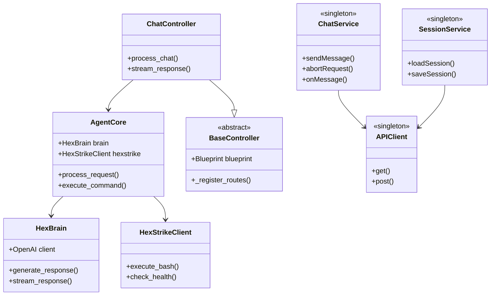

# HexAgentGUI - Architecture Documentation
# HexAgentGUI - Documentação de Arquitetura

**Version:** 2.0.0  
**Last Updated:** 2026-01-13  
**Architecture:** React + Flask + AgentCore

---

## 🏗️ SYSTEM OVERVIEW

```
┌─────────────────────────────────────────────┐
│           HEXAGENT GUI (Electron)           │
├─────────────────────────────────────────────┤
│                                             │
│  ┌──────────────┐      ┌────────────────┐  │
│  │   Frontend   │◄────►│    Backend     │  │
│  │  (React UI)  │ HTTP │  (Flask API)   │  │
│  └──────────────┘      └────────────────┘  │
│         │                      │            │
│         ▼                      ▼            │
│   Services Layer        AgentCore          │
│   - ChatService         - HexBrain (AI)    │
│   - SessionService      - HexStrikeClient  │
│   - APIClient                               │
└─────────────────────────────────────────────┘
              │
              ▼
     External APIs
     - OpenRouter  
     - HexStrike (port 8888)
```

---

## 📁 FILE TREE (Simplified)

```
HexAgentGUI/
├── backend/                    # Flask API Server
│   ├── core/                   # Core business logic
│   │   ├── agent_core.py       # Main orchestrator
│   │   ├── hex_brain.py        # AI interface  
│   │   ├── hex_strike_client.py# HexStrike client
│   │   └── base_controller.py  # Controller base class
│   ├── controllers/            # HTTP endpoints (8 controllers)
│   │   ├── chat_controller.py  # /chat endpoint
│   │   ├── session_controller.py
│   │   ├── config_controller.py
│   │   └── ...
│   ├── services/               # Business services
│   │   ├── ai_config_service.py
│   │   ├── system_config_service.py
│   │   └── config_service.py
│   ├── managers/               # Domain managers
│   │   ├── file_manager.py
│   │   └── project_manager.py
│   ├── utils/                  # Utilities
│   └── app.py                  # Flask app factory ⭐
│
├── src/                        # React Frontend
│   ├── components/             # UI Components (26 files)
│   │   ├── AIConfigModal.jsx
│   │   ├── ChatContainer.jsx
│   │   ├── CommandProposal.jsx  # NEW AgentCore
│   │   ├── ServiceManagerModal.jsx
│   │   └── ...
│   ├── services/               # Business logic
│   │   ├── ChatService.js      # NEW SSE handler ⭐
│   │   ├── SessionService.js
│   │   └── ...
│   ├── hooks/                  # Custom React hooks
│   │   ├── useAIConfig.js
│   │   ├── useSystemConfig.js
│   │   └── useTranslation.js
│   ├── utils/                  # Helper utilities
│   │   ├── APIClient.js        # HTTP client ⭐
│   │   ├── scriptManager.js
│   │   └── tempFileManager.js
│   └── App.jsx                 # Main component (1900 lines) ⚠️
│
├── electron/                   # Electron main process  
│   └── main.ts                 # App initialization
│
├── scripts/                    # Build/deploy scripts
│   └── integrate_app_jsx.py    # Automation script
│
├── docs/                       # Documentation
└── config_templates/           # Config examples

**Total:** 1142 .md files, 134 .py files, 115 .js/.jsx files
```

---

## 🔷 CLASS DIAGRAM (Core)



---

## 📚 LIBRARY STACK

### Backend Dependencies
```python
# Core
Flask==3.0.0           # Web framework
flask-cors==4.0.0      # CORS support

# AI / HTTP
openai==1.3.7          # OpenAI client (OpenRouter compatible)  
requests==2.31.0       # HTTP client
httpx==0.25.2          # Async HTTP

# Utilities
python-dotenv==1.0.0   # Environment variables
pathlib                # Path manipulation (stdlib)
```

### Frontend Dependencies
```json
{
  "react": "^18.2.0",
  "react-dom": "^18.2.0",
  "vite": "^5.4.2",
  "electron": "^31.7.7",
  "prismjs": "^1.29.0",        // Code highlighting
  "lucide-react": "^0.263.1",  // Icons
  "axios": "^1.6.0"            // HTTP client
}
```

---

## 🔗 DEPENDENCY GRAPH

```
Frontend (React)
    │
    ├─► ChatService ──► APIClient ──► Backend Flask
    ├─► SessionService ──► APIClient
    └─► UI Components
    
Backend (Flask)
    │
    ├─► ChatController ──► AgentCore ──┬─► HexBrain ──► OpenRouter API
    ├─► SessionController              └─► HexStrikeClient ──► HexStrike (8888)
    └─► ConfigController ──► ConfigService
```

---

## 🎯 ARCHITECTURAL PATTERNS

### Backend
1. **MVC Pattern:** Controllers + Services + Models
2. **Factory Pattern:** `create_app()` in app.py
3. **Singleton:** Config services
4. **Dependency Injection:** Controllers receive AgentCore reference

### Frontend
1. **Component-Based:** React components
2. **Singleton Services:** ChatService, SessionService, APIClient
3. **Observer Pattern:** SSE event handlers
4. **Facade Pattern:** APIClient wraps fetch/axios

---

## 📊 METRICS

| Layer | Files | Lines | Classes | POO Score |
|-------|-------|-------|---------|-----------|
| Backend | 134 | ~15k | 31+ | 9/10 |
| Frontend | 115 | ~25k | 10+ services | 7/10 |
| **Total** | **249** | **~40k** | **41+** | **8/10** |

---

## 🚀 SCALABILITY NOTES

**Strengths:**
- Modular architecture
- Clear separation of concerns
- POO compliance
- Pluggable AI engines (planned)

**Limitations:**
- App.jsx God Object (1900 lines)
- Some state not centralized
- Missing state managers

**Recommended:**
- Extract state managers
- Microservices architecture (future)
- WebSocket support for bidirectional communication

---

**Status:** Production-ready with refactoring recommended
