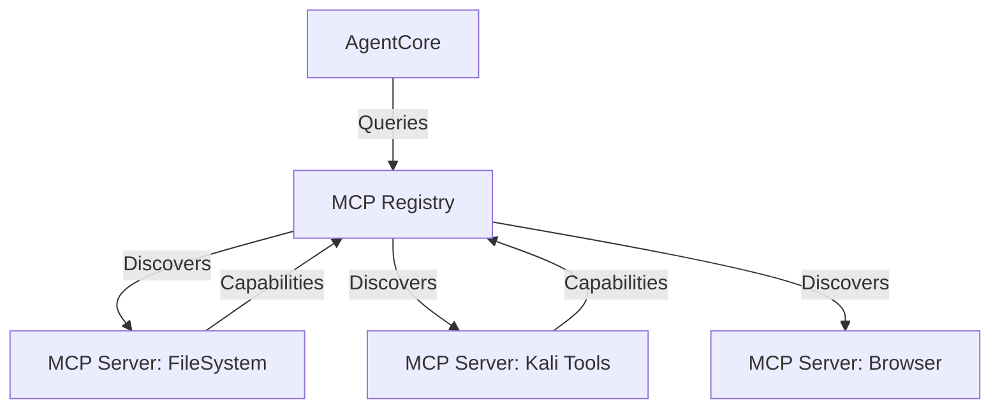

# MCP Service Registry Design
# Design do Registro de Serviços MCP

> **Status:** Draft (Rascunho)
> **Target Version:** 2.2.0

## 1. Overview / Visão Geral

The **Model Context Protocol (MCP)** Service Registry will allow `HexAgentGUI` to dynamically discover and communicate with external tools and agents without hardcoded integrations. This transforms the agent from a static tool user into an extensible platform.

O **Registro de Serviços MCP** permitirá que o `HexAgentGUI` descubra e se comunique dinamicamente com ferramentas e agentes externos sem integrações hardcoded. Isso transforma o agente de um usuário de ferramentas estático em uma plataforma extensível.

## 2. Architecture / Arquitetura



### 2.1 Core Components
1.  **Registry Manager**: Scans configuration (`~/.hexagent-gui/mcp_config.json`) and active ports.
2.  **Client Factory**: Generates dynamic client instances based on MCP capability negotiation.
3.  **Tool Bridge**: Maps MCP tools (functions) to the `InferenceEngine`'s tool schema (OpenAI/Claude format).

## 3. Configuration / Configuração

**Location:** `~/.hexagent-gui/mcp_config.json`

```json
{
  "mcpServers": {
    "filesystem": {
      "command": "npx",
      "args": ["-y", "@modelcontextprotocol/server-filesystem", "/home/user/workspace"]
    },
    "git": {
      "command": "python",
      "args": ["-m", "mcp_server_git", "--repository", "/path/to/repo"]
    }
  }
}
```

## 4. Implementation Steps / Passos de Implementação

1.  **Backend**:
    - Add `mcp` python library dependency.
    - Create `core/mcp_manager.py` to handle server spawning and STDIO communication.
    - Update `InferenceStrategy` to append MCP tools to the system prompt/API call.

2.  **Frontend**:
    - Add "MCP" tab to `ServiceManagerModal`.
    - Allow users to Add/Remove servers via UI.
    - Display "Connected Tools" list.

3.  **Security**:
    - Sandboxing for MCP servers (they run as subprocesses).
    - Limit file access scope.

## 5. Integration with HexStrike-AI

`HexStrike-AI` itself can expose an MCP interface, allowing other agents (like Claude Desktop) to control it if running in "Server Mode".

O próprio `HexStrike-AI` pode expor uma interface MCP, permitindo que outros agentes (como Claude Desktop) o controlem se estiver rodando em "Modo Servidor".
