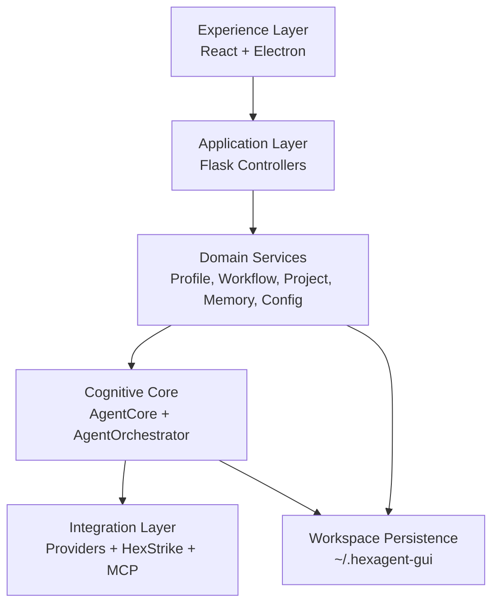

# MrQuentilha Base Blueprint
*Date: 2026-03-07*

This document extracts the structural, memory, governance, and planned evolution model of `HexAgentGUI` and defines it as the base architecture for `MrQuentilha`.

The objective is not to start a second architecture in parallel. The objective is to use the current `HexAgentGUI` operating model as the reference base, align what already exists, and let Codex evolve the codebase under one explicit contract.

This base must also be aligned for evolution through `Antigravity IDE`: workspace-first, artifact-driven, resumable, and safe for iterative AI-assisted refactoring.

## 1. Base Decision

`MrQuentilha` inherits the following from `HexAgentGUI`:

- Layered architecture: `frontend -> controllers -> services -> core -> integrations`.
- Workspace persistence outside the repo, centered on a user home directory.
- Agent execution through `AgentCore` and `AgentOrchestrator`.
- Product memory split between runtime memory, persistent memory, and architectural memory.
- Governance by living documents, phased roadmap, and validation gates.

`MrQuentilha` should therefore be treated as a product evolution line, not as an isolated rewrite.

## 2. Structural Model To Preserve

### 2.1 Layers

- Experience layer
  - React/Electron UI.
  - Block-based execution feedback.
  - Panels, modal flows, workspace navigation, config UX.

- Application layer
  - Flask blueprints as thin facades.
  - Each endpoint delegates to a service or core component.
  - No persistence or business rules should stay in controllers.

- Domain services layer
  - `ProfileService`, `WorkflowService`, `ProjectService`, `FileService`, `MemoryService`, config services, monitoring services.
  - Services own file formats, domain validation, and persistence contracts.

- Cognitive core layer
  - `AgentCore` is the entry point.
  - `AgentOrchestrator` owns the Think -> Act -> Observe loop.
  - Provider selection, memory injection, planning context, and execution routing belong here.

- Integration layer
  - External AI providers.
  - `HexStrikeClient`.
  - `MCPManager`.
  - Future vendor adapters for `MrQuentilha`.

- Persistence layer
  - User workspace under `~/.hexagent-gui` today.
  - For `MrQuentilha`, the path can be rebranded later, but only behind a service/config abstraction.

### 2.2 Structural Rules

- Controllers remain thin.
- Services remain the only write path for domain persistence.
- The UI must not embed provider logic or shell policy.
- The orchestrator must not absorb product-specific UI rules.
- Every new capability must declare its layer ownership before implementation.

## 3. Memory Architecture Base

The current project already has multiple memory types, but they are implicit. `MrQuentilha` should make them explicit and keep them separated.

| Memory Layer | Purpose | Current Artifact | Base Rule for MrQuentilha |
| --- | --- | --- | --- |
| Runtime memory | Transient UI and execution state | React state, block manager, SSE stream | Never persist blindly; keep session-scoped |
| Session memory | Recoverable user interactions | `~/.hexagent-gui/sessions/` | Store session history and resumable context |
| Operational memory | Logs, temp files, backups, project files | `logs/`, `tmp/`, `backups/`, `projects/` | Keep operational traces separated from AI memory |
| Long-term AI memory | Retrieved context for the agent | `~/.hexagent-gui/memory.json`, `MemoryService` | Upgrade retrieval quality, but preserve clear ownership |
| Profile memory | Stable user identity and constraints | `ProfileService`, `profile.json` / `user_profile.json` | Normalize to one contract and inject through core |
| Architectural memory | Current system state for future sessions | `livememory.md` | Mandatory update after structural decisions |
| Governance memory | Timeline, roadmap, debt, decisions | `project_evolution.md`, `roadmap.md`, `AUDIT_REPORT.md` | Mandatory update after roadmap or governance changes |

### 3.1 Immediate Memory Gaps To Fix

- `ProfileService` still points to `user_profile.json`, while templates and UI references also use `profile.json`.
- `MemoryService` is persistent but uses simple keyword matching and has no stronger tagging or retrieval contract.
- Architectural memory and governance memory exist, but the update protocol was not written down clearly before this blueprint.

## 4. Governance Model

Governance in `MrQuentilha` should be document-driven and code-verified.

### 4.1 Source Of Truth Matrix

- System shape and boundaries
  - `ARCHITECTURE.md`

- Current active strategic state
  - `livememory.md`

- Decision timeline and phase ledger
  - `project_evolution.md`

- Strategic delivery plan
  - `roadmap.md`

- Risk, debt, and audit findings
  - `AUDIT_REPORT.md`

- Executable contracts
  - `backend/controllers/`
  - `backend/services/`
  - `backend/core/`
  - automated tests

### 4.2 Governance Rules

- No structural change without updating at least the relevant living document.
- No new endpoint without service ownership and test coverage.
- No roadmap phase starts without naming dependencies and exit criteria.
- No memory feature should mix operational logs, profile data, and AI retrieval into one file.
- No "shadow architecture": if a module is declared strategic, it must either be implemented, planned with a date, or removed.

### 4.3 Codex Working Protocol

When Codex evolves `HexAgentGUI` as the base of `MrQuentilha`, the normal flow should be:

1. Read the active context in `livememory.md` and `project_evolution.md`.
2. Check the structural contract in `ARCHITECTURE.md` and this blueprint.
3. Implement in the correct layer only.
4. Validate with tests or explicit runtime verification.
5. Record the resulting decision in memory/governance docs.

## 5. Antigravity IDE Alignment

The architecture must be compatible with the way `Antigravity IDE` evolves software: through persistent workspace context, explicit artifacts, resumable sessions, and narrow refactoring loops.

### 5.1 Alignment Principles

- Workspace-first
  - Source code, governance docs, and implementation artifacts must live in the repository in predictable paths.
  - Runtime data may stay under `~/.hexagent-gui`, but product decisions must not depend on hidden local-only context.

- Artifact-driven evolution
  - Plans, findings, architecture updates, and state maps must be committed as files, not left only in chat context.
  - `implementation_plan.md`-style artifacts are first-class inputs for future iterations.

- Resumable delivery
  - A new session must be able to recover intent from `livememory.md`, `project_evolution.md`, roadmap, audits, and implementation plans.
  - No critical project state should exist only in transient agent memory.

- Stable boundaries for IDE automation
  - Controllers, services, and core modules must remain clearly separated.
  - Config files should stay machine-readable and deterministic.
  - Startup and validation paths should be scriptable.

- Safe refactoring loops
  - Every non-trivial change should have a bounded target area, explicit verification path, and a document update when architectural meaning changes.

### 5.2 Required Repository Artifacts

`MrQuentilha` should preserve and expand this artifact set for Antigravity-driven evolution:

- strategic memory
  - `livememory.md`
  - `project_evolution.md`

- architecture and governance
  - `ARCHITECTURE.md`
  - `roadmap.md`
  - `AUDIT_REPORT.md`

- implementation artifacts
  - `DEV_GUIA_IA/**/implementation_plan.md`
  - state maps
  - findings summaries
  - targeted refactor guides

- executable validation
  - controller/service/core tests
  - startup scripts
  - deterministic config templates

### 5.3 Architectural Constraints For Antigravity Compatibility

- Do not couple the core logic to IDE vendor APIs.
- Keep IDE alignment at the workflow and artifact layer, not inside business logic.
- Prefer plain JSON, Markdown, and stable scripts over hidden in-app state.
- Ensure each architectural phase has entry documents, code boundaries, and exit checks.
- Treat duplicated source/deploy trees as controlled outputs, not parallel authorities.

### 5.4 Practical Operating Model

For `MrQuentilha`, the expected Antigravity-compatible loop is:

1. recover state from living docs and implementation artifacts
2. inspect the bounded subsystem
3. implement in the correct layer
4. verify with tests or runtime checks
5. update memory/governance artifacts
6. leave the workspace ready for the next resumed iteration

## 6. Planned Evolution Base

The roadmap already defines phases. `MrQuentilha` should reuse that phased discipline, but tighten the priorities.

### Phase 0: Alignment And Normalization

- Consolidate structural documentation around one architecture contract.
- Normalize memory contracts and profile naming.
- Remove duplicated or drifting source/deploy structures where possible.
- Strengthen the test baseline for controllers, services, and core flows.

### Phase 1: Core Hardening

- Break `AgentOrchestrator` into smaller responsibilities.
- Improve long-term memory retrieval and tagging.
- Formalize execution policy boundaries between UI, core, and integrations.
- Expand regression coverage for orchestration and persistence.

### Phase 2: Product Shaping

- Add product-specific workflows and panels for `MrQuentilha`.
- Keep the same layer boundaries.
- Keep workspace and memory abstractions product-neutral where possible.

### Phase 3: Adaptive Platform

- Dynamic personas/plugins.
- Passive monitoring and telemetry loops.
- Multi-agent mesh only after the core is stable and observable.

## 7. Alignment Of Current HexAgentGUI

### Keep As Base

- `controllers -> services -> core` separation.
- `AgentCore` as the main orchestration entry point.
- Workflow templates and workspace-based persistence.
- Living docs (`livememory.md`, `project_evolution.md`).
- External integration boundaries (`HexStrikeClient`, providers, MCP).

### Refactor Early

- `AgentOrchestrator` monolith.
- Profile file naming inconsistency.
- Implicit memory taxonomy.
- Duplicated source/deploy resource trees that can drift.
- Audit gaps and incomplete endpoint coverage.

### Defer

- Multi-agent mesh.
- Optional cloud sync.
- New advanced dashboards not required for base hardening.

## 8. Immediate Codex Backlog

1. Normalize profile and memory contracts.
2. Formalize the memory taxonomy inside code and docs.
3. Split the orchestrator into smaller bounded components.
4. Expand controller/service test coverage as governance gates.
5. Reduce shadow architecture and duplicated deployment drift.
6. Consolidate the Antigravity artifact protocol around implementation plans, findings, and resumable state docs.

## 9. Practical Conclusion

From 2026-03-07 onward, `HexAgentGUI` is the architectural seed for `MrQuentilha`.

The operational interpretation is simple:

- evolve the current project instead of inventing a parallel one,
- keep memory and governance explicit,
- preserve layer boundaries,
- and let every new Codex change trace back to this base contract.
