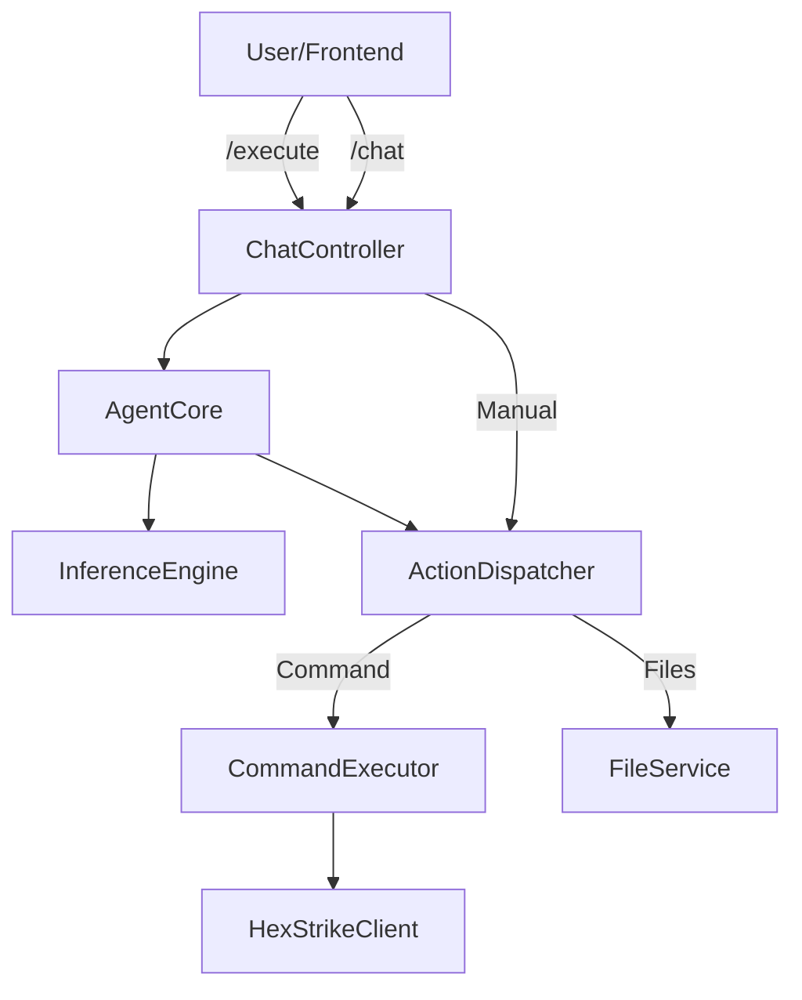

# Refactoring Walkthrough / Walkthrough de Refatoração

## Overview / Visão Geral
Major architectural refactoring to enforce OOP principles, centralize logic, and remove legacy debt.
Grande refatoração arquitetural para impor princípios de POO, centralizar lógica e remover dívida técnica.

## 1. Migration from Managers to Services / Migração de Managers para Services
**Goal:** Standardize backend components as stateless Services.
**Changes:**
- **Deleted:** `backend/managers/` directory.
- **Created:** `backend/services/file_service.py` (from `file_manager.py`).
- **Created:** `backend/services/project_service.py` (from `project_manager.py`).
- **Refactored:** `FileController` now uses `FileService` via Dependency Injection.

## 2. centralized Action Dispatcher / Action Dispatcher Centralizado
**Goal:** Create a single source of truth for system actions (Commands, Files).
**Changes:**
- **Created:** `backend/core/action_dispatcher.py`.
- **Logic:** Handles `execute_command`, `write_file`, `read_file` with unified logging/validation.
- **Integration:** 
    - `AgentCore` delegates automated actions to Dispatcher.
    - `ChatController` delegates manual `/execute` actions to Dispatcher.

## 3. Legacy Cleanup / Limpeza de Legado
**Goal:** Remove unused code.
**Changes:**
- **Deleted:** `backend/config_loader.py` (Redundant with `ConfigService`).
- **Verified:** `SystemController` endpoints (`/shutdown`, `/health`) are robust.

## 4. Verification steps / Passos de Verificação
1.  **Rebuild:** Run `./install.sh` to rebuild dependencies (if new deps added - none here, but good practice).
2.  **Start:** Run `./start.sh`.
3.  **Test Manual Command:** In CLI mode, try `ls -la`. It should work via `/execute` -> `Dispatcher` -> `Executor` -> `HexStrike`.
4.  **Test Agent Command:** Ask AI to "Check system uptime". It should propose and execute `uptime`.

## Architecture Update / Atualização de Arquitetura

