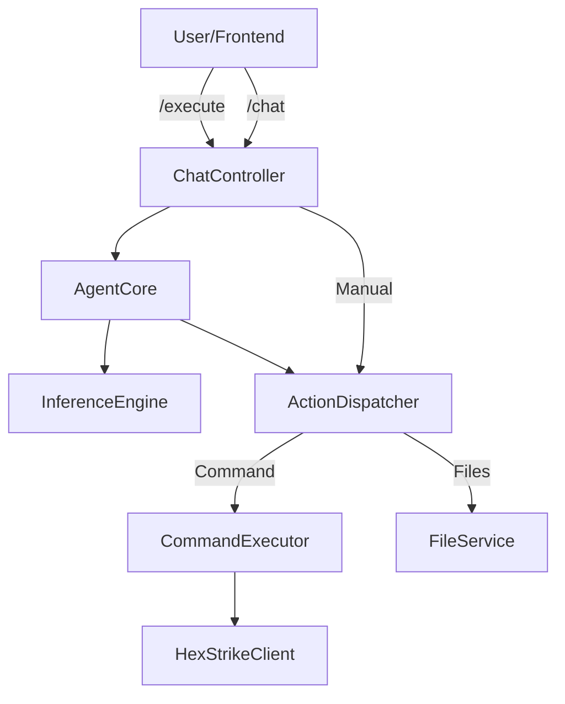

# Refactoring Walkthrough / Walkthrough de Refatoração

## Overview / Visão Geral
Major architectural refactoring to enforce OOP principles, centralize logic, and remove legacy debt.
Grande refatoração arquitetural para impor princípios de POO, centralizar lógica e remover dívida técnica.

## 1. Migration from Managers to Services / Migração de Managers para Services
**Goal:** Standardize backend components as stateless Services.
**Changes:**
- **Deleted:** `backend/managers/` directory.
- **Created:** `backend/services/file_service.py` (from `file_manager.py`).
- **Created:** `backend/services/project_service.py` (from `project_manager.py`).
- **Refactored:** `FileController` now uses `FileService` via Dependency Injection.

## 2. centralized Action Dispatcher / Action Dispatcher Centralizado
**Goal:** Create a single source of truth for system actions (Commands, Files).
**Changes:**
- **Created:** `backend/core/action_dispatcher.py`.
- **Logic:** Handles `execute_command`, `write_file`, `read_file` with unified logging/validation.
- **Integration:** 
    - `AgentCore` delegates automated actions to Dispatcher.
    - `ChatController` delegates manual `/execute` actions to Dispatcher.

## 3. Frontend Optimization
**Goal:** Fix race conditions and improve stability.
**Changes:**
- **`ChatService.js`:** Fixed Observer pattern race condition during unsubscribe (iterating over copy).
- **`useChatManager.js`:** Added `isMounted` ref to prevent state updates on unmounted components.

## 4. Initialization Sequence / Sequência de Inicialização
**Goal:** Enforce startup order and clean shutdown.
**Changes:**
- **`start.sh`:** Updated sequence: Venv -> HexStrike (8888) -> Backend (5000) -> Frontend.
- **Trap:** Added `trap cleanup EXIT` to ensure both Backend and HexStrike are killed when Frontend closes.

## 5. Security & Firewall Configuration / Configuração de Segurança e Firewall
**Goal:** Restrict access to ports 5000 and 8888 to localhost only.
**Changes:**
- **`app.py`:** Changed Flask bind address from `0.0.0.0` to `127.0.0.1`.
- **`start.sh`:** Added export `HEXSTRIKE_HOST="127.0.0.1"` to enforce local binding for the AI engine.

## 6. Bilingual Standardization
**Goal:** Ensure 100% Eng/PT-BR comments.
**Changes:**
- **`hex_brain.py`:** Translated remaining monolingual comments.

## 7. Bug Fixes & Stability / Correção de Bugs e Estabilidade
**Issue 1: System Offline False Positive**
- **Symptom:** AI Config connection test successful, but main chat shows "Offline".
- **Cause:** Frontend expected status `ok`, Backend returned `healthy`.
- **Fix:** Updated `useBackendInit.js` to accept `healthy` status.

**Issue 2: AI Configuration Not Loading**
- **Symptom:** LM Studio settings saved but not applied on restart (reverted to OpenAI).
- **Cause:** Backend (`app.py`) was reading legacy `config.json`. Also, backend process persistence meant `AgentCore` was never re-initialized with new settings.
- **Symptom:** "System Offline" despite valid config. Logs showed `LMStudioStrategy` attempting to connect to `localhost`.
- **Cause:** Discrepancy between "nested" vs "flat" config handling in Controller vs Factory.
- **Fix:** Implemented `AIConfigService.get_active_provider_config()` as Single Source of Truth for flattened config generation.

**Issue 3: Shutdown Crash**
- **Symptom:** `AttributeError: 'AgentCore' object has no attribute 'shutdown'` in logs.
- **Fix:** Implemented graceful `shutdown()` method in `AgentCore`.

**Issue 4: Local Engine Support (5ire, Ollama)**
- **Symptom:** App refused to start without API key, even for local engines.
- **Fix:** 
    1. Updated `AIConfigService` validation to make API key optional for local engines.
    2. Updated `app.py` to use Service helper for unified initialization logic.
    3. Registered aliases (`5ire`, `ollama`) to generic `LMStudioStrategy`.
- **Fix:** 
    1. Refactored `app.py` to use `AIConfigService`.
    2. Implemented **Hot Reloading** in `ConfigController`.
    3. Updated `AgentCore.initialize()` to support full runtime reconfiguration (Engine, Model, Host, Port).

## 8. Hot Reload Architecture
To avoid restart requirements and persistence issues, the following flow was implemented:
1. **Frontend** sends `POST /config/ai` with new settings.
2. **`ConfigController`** saves to `ai-config.json` via `AIConfigService`.
3. **`ConfigController`** calls `agent_core.initialize()` with the new configuration.
4. **`AgentCore`** rebuilds the `Provider` (e.g. `LMStudioStrategy`) instantly.
This ensures "Click Save -> Immediate Effect" without needing to restart the application.
- **`inference_engine.py`:** Verified bilingual compliance.

## 5. Legacy Cleanup / Limpeza de Legado
**Goal:** Remove unused code.
**Changes:**
- **Deleted:** `backend/config_loader.py` (Redundant with `ConfigService`).
- **Verified:** `SystemController` endpoints (`/shutdown`, `/health`) are robust.

## 6. Verification steps / Passos de Verificação
1.  **Rebuild:** Run `./install.sh` to rebuild dependencies.
2.  **Start:** Run `./start.sh`.
3.  **Test Chat:** Send a message and quickly navigate away (simulate unmount) -> check logs for errors (should be clean).
4.  **Test Manual Command:** In CLI mode, try `ls -la`. It should work via `/execute` -> `Dispatcher`.

## Architecture Update / Atualização de Arquitetura

